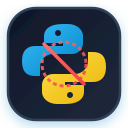

<div align="center">



# 🐍 KillVenv

**Cross-platform terminal utility to hunt, inspect, and safely eradicate abandoned Python virtual environments across all drives.**

[](LICENSE)
[](#requirements)
[](#quick-start)
[](#quick-start)

</div>

---

Python virtual environments devour gigabytes of disk space silently across project folders, package caches, and forgotten temp directories. **KillVenv** scans all local storage volumes, verifies environments with strict structural checks (never relying on folder names alone), calculates reclaimed disk space, and provides an interactive TUI to review and prune them safely.

---

## ⚡ Quick Start (Run Without Installation)

Run directly from terminal without cloning or installing dependencies:

### 🪟 Windows (PowerShell)

Open PowerShell and paste:

```powershell
$url="https://raw.githubusercontent.com/zpratikpathak/KillVenv/home/venv-clean.ps1"; $file="$env:TEMP\venv-clean.ps1"; Invoke-WebRequest $url -OutFile $file; & $file
```

> ⚠️ **Note:** Requests Administrator elevation if needed to inspect all local drives and protected system directories.

### 🍎🐧 macOS & Linux (Bash)

Open terminal and paste:

```bash
bash <(curl -fsSL https://raw.githubusercontent.com/zpratikpathak/KillVenv/home/venv-clean.sh)
```

---

<p align="center">
  
</p>

---

## ✨ Features

- 🔍 **Full Drive Sweep**: Automatically scans all mounted local volumes (`C:`, `D:`, root filesystem, external development drives).
- 🎯 **Zero False Positives**: Uses strict structural verification (`pyvenv.cfg`, activation scripts, binary layouts, `conda-meta`) instead of guessing by directory name.
- 🐍 **Universal Python Ecosystem Support**: Detects `venv`, `virtualenv`, `uv`, `poetry`, `pipenv`, `conda`, `pdm`, and `hatch`.
- 🔒 **Active Environment Protection**: Automatically detects and locks active environments (`$VIRTUAL_ENV`, `$CONDA_PREFIX`), running Python processes, and core toolchains (`pipx`, `uv` tools, Conda base).
- 🖥️ **Interactive TUI**: Keyboard-driven navigation with multi-select, select all unprotected, real-time disk reclamation stats, and confirmation safeguard.
- 🪶 **Zero External Dependencies**: Windows script runs on native PowerShell 5.1/7+. Unix script runs on native Bash 3.2+ and POSIX utilities.

---

## ⌨️ Controls

| Key | Action |
| --- | --- |
| `Up` / `Down` | Move cursor through detected environments |
| `PageUp` / `PageDown` | Scroll view one page |
| `Home` / `End` | Jump to start / end of list |
| `Space` | Select or deselect focused environment |
| `A` | Select / deselect all unprotected environments |
| `Enter` | Review deletion plan and confirm deletion |
| `R` | Rescan filesystem drives |
| `Q` / `Ctrl+C` | Cancel and exit cleanly |

---

## 🛡️ Safeguards & Protections

KillVenv is engineered defensively to prevent accidental deletions:

1. 🔍 **Structural Signature Verification**: A folder named `.venv` or `env` is skipped unless it contains valid Python environment binaries, activation layouts, or package metadata.
2. 🔒 **Active Environment Lock**: Environments currently active in your current shell or session cannot be selected.
3. ⚙️ **Running Process Detection**: Scans system processes; any virtual environment actively hosting running Python processes is locked.
4. 🧱 **Toolchain Preservation**: Global CLI tool managers (`pipx`, `uv tool`) and Conda base installations are marked protected.
5. 🛑 **Confirmation Step**: Displays selected environment count and total bytes reclaimed before executing any deletion.

---

## 🛠️ Manual Usage

### 🪟 Windows

```powershell
# Clone repository
git clone https://github.com/zpratikpathak/KillVenv.git
cd KillVenv

# Run scanner
powershell -ExecutionPolicy Bypass -File .\venv-clean.ps1

# Optional parameters
.\venv-clean.ps1 -NoElevation              # Run without admin prompt
.\venv-clean.ps1 -IncludeNetworkDrives      # Scan network shares
.\venv-clean.ps1 -Roots "C:\Projects","D:" # Restrict scan roots
```

### 🍎🐧 macOS / Linux

```bash
# Clone repository
git clone https://github.com/zpratikpathak/KillVenv.git
cd KillVenv
chmod +x venv-clean.sh

# Run interactive cleaner
./venv-clean.sh

# Optional CLI flags
./venv-clean.sh --root ~/Projects          # Scan specific directory
./venv-clean.sh --list                     # Print summary without TUI
./venv-clean.sh --deep                     # Do not prune heavy non-env dirs
./venv-clean.sh --include-network          # Include network mounts
./venv-clean.sh --no-color                 # Plain output for logs
```

---

## 📋 Requirements

- **Windows**: Windows 10/11 or Windows Server, Windows PowerShell 5.1 or PowerShell 7+.
- **macOS / Linux**: Bash 3.2+ (standard on macOS and Linux distros).
- **Network**: Internet access required only when using the one-line remote runner.

---

## 👤 Author

Created by [Pratik Pathak](https://github.com/zpratikpathak).

---

## 📄 License

This project is licensed under the MIT License. See [LICENSE](LICENSE) for details.
